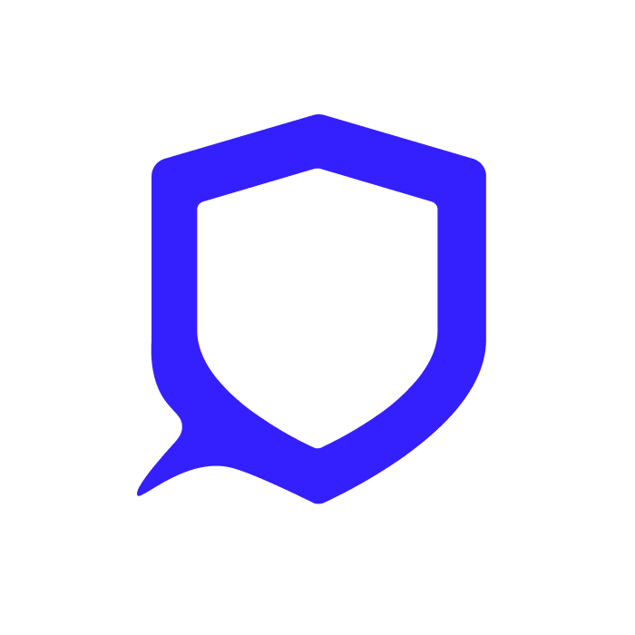
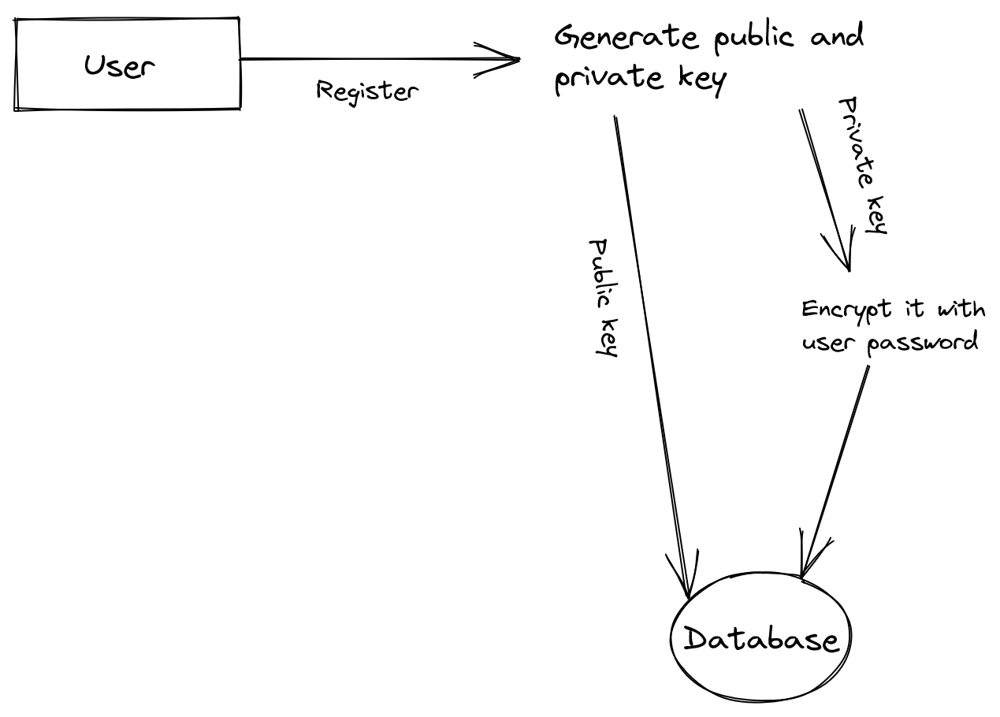

# Ake Api

Ake is an open-source messenger where you can chat safely and privately. 

This repo is only hosting the Api. The client side has not yet been developped, you can dot it if you want to contribute to the projects. More informations for dev [here](./fordevs.md)

⚠️ Warning, this project is not yet mature. If you really want an open-source and functional encrypted messaging, I recommend [Signal](https://github.com/signalapp) or the [Matrix ecosystem](https://github.com/matrix-org). In the meantime, you can contribute to the development of Ake by participating to the code or by using the messaging.

## Features ✌️

-   Create your account, with your username, description etc...
-   Create conversations with who you wants
-   Send messages privately
-   Edit your account

## Security 🔐

**Quick introduction to encryption and hashing**
To get started and to make you understand, we are going to explain you the difference between hashing and ciphering (also called encryption). These functions are really different but they have the same goal who is : "avoid that a stranger can understand some text".

The **hashing** is used to transform a basic string of characters (ex → `hello`) into an unrecognisable string (`$2y$10$CpYTnh.dsVLC0kplPM.83JCUPUpY5MhxiMO7yIvYMIf/DxK3SxYS`). You can't "unhash" something. It's really used for stock password into databases.

**Cipher** is different. It's making like hashing (transforms a basic string of characters into an uncrognisable string) but the main difference is that you can "decrypt" this string. You will perhaps know encryption with "Cesar Cipher" (it's when when you shift each letter of your message by three letters in the alphabet) or maybe with the Engima Machine (it was used by Germans during WWII) to cipher their messages.

What you have to understand, is that an hashed value is like a lost value. For example, passwords. When you login to your account, the system is going to take the password that you entered, hash it and compare it to the hashed password who is stocked in the database but never, you can know what is the "unhashed" value while you can know what is the decrypted value.

**How are we doing ?**
First, we are going to talk about your Ake password. This password is hashed and stock into DB (database).

Then, for the messages you are sending in Ake, we use ciphering and more precisely [symetric encryption](https://en.wikipedia.org/wiki/Symmetric-key_algorithm). This a system where there is only one key who is ciphering and deciphering messages. There is one key for each conversation. But, of course, this key must also be encrypted so that it cannot be used by anyone other than the user. This is where we use [asymetric encryption](https://en.wikipedia.org/wiki/Public-key_cryptography). It's a genre of encryption where there is two key : one public and one private who are specifics to each people. The public one is used to cipher the key (of symetric encryption) and the private one to decipher the key (of symetric encryption).

But the main problem for us was to stock the private key. Indeed if it's private, we can't just stock it in a DB. It will be stupid. So we found a solution to resolve this problem, it's to encrypt the private key with the password.

We made three schemas to resume everything :

_When the user register_

_When the user starts a conversation_

_When the user sends a message_

**Suggestions**
We have just one suggestion to keep your passwords safe. Just ONE. Choose a strong password for Ake. Indeed, it's your password who is ciphering the private key and it's your private key who is deciphering your passwords who are stocked in the DB. If a hacker succeed to get your private key, he gets all your keys (so all of your messages) and the safety of the private key depends on the safety of your pasword.

**Librairies**

-   Crypto : node native library, used for generation of public and private key + symetric key and for encryption. [[https://nodejs.org/api/crypto.html](https://nodejs.org/api/crypto.html)]
-   Phc-argon2 : used for hashing passwords. [[https://www.npmjs.com/package/phc-argon2](https://www.npmjs.com/package/phc-argon2)]
-   Crypto-js : used for encryption [[https://www.npmjs.com/package/crypto-js](https://www.npmjs.com/package/crypto-js)]

## More... 😇

**Ethical**
We will never disclose your private data. Btw if you read our security article, you will know that we have only access to your email, public key and username. Nothing more because as we said, your password is hashed, for the private key we can only decipher it with your password and for the passwords you save, for decipher them, we need to have the private key. If we resume (← means "depends") : password ← private key ← your passwords saved.

There will never be some ads here. Everybody hate ads and we also do. If we are doing this project, it's not to earn money but to support people. Keeping passwords is a big deal in this new world where each piece of private data is sold and we wanted to act.

**Acknowledgments**
I first wanted to thank Louis, the front-end dev who accepted my idea. I also have a thought for Gautier who helped us on the design. Finally, I would like to thank all the Discord servers who helped me when I was blocked, and in particular ES Community (french guild) [[https://discord.gg/V2g89Ve](https://discord.gg/V2g89Ve)].

## Authors 👤

We are two french developpers who are 16 years old.

👉 Louis Legrain : Front-End developper

👉 Marin Recope : Back End developper

-   Twitter : [@wshchocolatine1](https://twitter.com/wshchocolatine1)
-   Discord : wshchocolatind#0444

## License

Copyright - © 2021 - Marin Recope
MIT LICENSE
